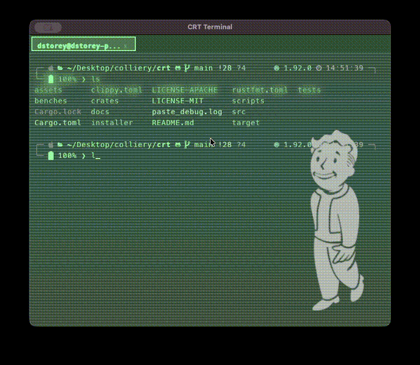

# CRT's a Ridiculous Terminal

<p align="center">
  
</p>

<p align="center">
  <strong>A GPU-accelerated terminal that's actually fun to look at.</strong>
</p>

<div align="center">

> ### *"This is cool!"*
>
> — Mat (6 years old)

</div>

<p align="center">
  
</p>

## Why?

I really like [Hyper.js](https://github.com/vercel/hyper) - being able to use CSS to style a terminal just made it *fun*. But it hasn't been maintained and has been regressing in performance. So like anyone who hasn't tried to do the thing before, I decided "How hard could it be?"

This is the result. It's not as fast as [rio](https://rioterm.com/) or [alacritty](https://alacritty.org/), but it's got CSS theming, visual effects, and my 6-year-old thinks it's cool. What more could you want?

## What makes it fun

- **CSS Theming** - Style your terminal like a website. Hot-reload on save.
- **Visual Effects** - CRT scanlines, matrix rain, particle systems, animated sprites
- **16 Built-in Themes** - Synthwave, Matrix, Nyan Cat, Fallout Pip-Boy, and more
- **GPU Rendering** - Smooth 60fps via wgpu/vello

## Install

```sh
curl -sSL https://raw.githubusercontent.com/colliery-io/crt/main/scripts/install.sh | sh
```

> Windows support coming [Soon™](https://wowpedia.fandom.com/wiki/Soon)

## Quick Start

1. Launch CRT from Applications (macOS) or run `crt` (Linux)
2. Edit `~/.config/crt/config.toml` to try different themes:
   ```toml
   [theme]
   name = "matrix"  # or "nyancat", "synthwave", "minimal", etc.
   ```
3. Save and press `Cmd+N` for a new window with your theme

## Themes

CRT includes 16 built-in themes. See the [Theme Gallery](docs/gallery/README.md) for screenshots.

| Theme | Description |
|-------|-------------|
| `alien` | Amber phosphor CRT (Weyland-Yutani MU/TH/UR 6000) |
| `dracula` | Classic Dracula color scheme |
| `matrix` | Green falling code with CRT effect |
| `minimal` | Clean, pure black background |
| `nyancat` | Bouncing Nyan Cat with stars and sparkles |
| `particles` | Floating particle effect |
| `rain` | Animated rain drops |
| `robco` | Fallout Pip-Boy green phosphor CRT |
| `shape` | Floating geometric shapes |
| `solarized` | Solarized Dark color scheme |
| `starfield` | Twinkling stars background |
| `stress` | All effects at once (for testing) |
| `synthwave` | 80s neon with perspective grid |
| `tron` | Cyan grid aesthetic |
| `vaporwave` | Pink and cyan aesthetic with perspective grid |
| `wh40k` | Warhammer 40K Adeptus Mechanicus with servo skull |

### Custom Themes

Create your own at `~/.config/crt/themes/mytheme.css` and set `name = "mytheme"` in config.

- [How to Create a Custom Theme](docs/how-to/create-custom-theme.md)
- [CSS Properties Reference](docs/reference/theme-css-properties.md)
- [Full Theming Guide](docs/theming.md)

---

## Reference

### Keyboard Shortcuts

<details>
<summary>Windows & Tabs</summary>

| Shortcut | Action |
|----------|--------|
| Cmd+N | New window |
| Cmd+T | New tab |
| Cmd+W | Close tab |
| Cmd+Shift+W | Close window |
| Cmd+Shift+R | Rename window |
| Cmd+1-9 | Switch to tab 1-9 |
| Cmd+Shift+[ | Previous tab |
| Cmd+Shift+] | Next tab |
| Double-click tab | Rename tab |

</details>

<details>
<summary>Navigation</summary>

| Shortcut | Action |
|----------|--------|
| Shift+Page Up | Scroll up through history |
| Shift+Page Down | Scroll down through history |
| Shift+Home | Jump to top of scrollback |
| Shift+End | Jump to bottom |
| Cmd+Click | Open URL under cursor |

</details>

<details>
<summary>Search & Font</summary>

| Shortcut | Action |
|----------|--------|
| Cmd+F | Open search |
| Enter | Find next match |
| Escape | Close search |
| Cmd+= | Increase font size |
| Cmd+- | Decrease font size |
| Cmd+0 | Reset font size |

</details>

<details>
<summary>Other</summary>

| Shortcut | Action |
|----------|--------|
| Cmd+C | Copy selection |
| Cmd+V | Paste |
| Cmd+A | Select all |
| Cmd+K | Clear scrollback |
| Cmd+Option+P | Toggle profiling |
| Ctrl+Cmd+F | Toggle fullscreen |

</details>

### Building from Source

Requires Rust 2024 edition:

```sh
git clone https://github.com/colliery-io/crt.git
cd crt
cargo build --release
```

### Configuration

Config lives at `~/.config/crt/config.toml`. Themes at `~/.config/crt/themes/`.

### Accessibility

- **Focus indicators**: Visual focus rings on active elements
- **Keyboard navigation**: Full keyboard control for tabs, menus, search
- **Calm themes**: Use `minimal` or `dracula` if effects are distracting

Known limitation: No screen reader support yet.

### Troubleshooting

<details>
<summary>Fonts look wrong or missing characters</summary>

CRT bundles MesloLGS NF (a Nerd Font) at `~/.config/crt/fonts/`. If you see boxes, check the font family setting in config.

</details>

<details>
<summary>Theme not loading</summary>

- Check the theme file exists at `~/.config/crt/themes/{name}.css`
- Check terminal output for CSS parsing errors
- Background images and sprites need `Cmd+N` to reload

</details>

<details>
<summary>Performance issues</summary>

Themes with multiple effects use more resources. Try `minimal` or `dracula` for lightweight options.

</details>

<details>
<summary>Reactive themes not working</summary>

See the [Troubleshooting Guide](docs/troubleshooting.md) for shell integration setup.

</details>

### Reporting Issues

Enable profiling with `Cmd+Option+P`, reproduce the issue, then [open an issue](https://github.com/colliery-io/crt/issues) with the profile log from `~/.config/crt/`.

## Contributing

[Open a PR](https://github.com/colliery-io/crt/pulls)

## License

MIT OR Apache-2.0
